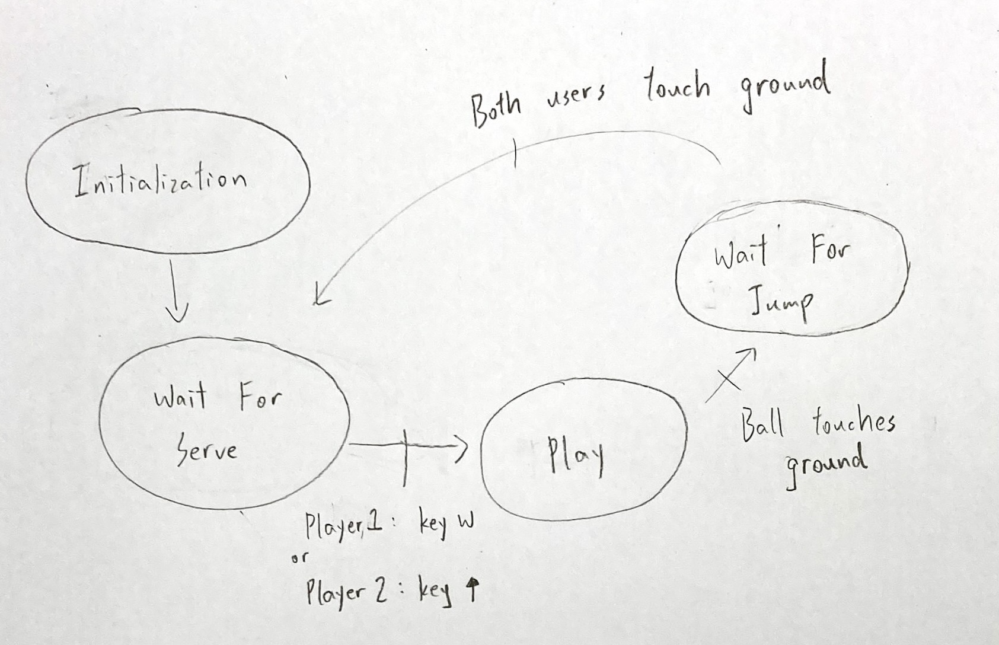
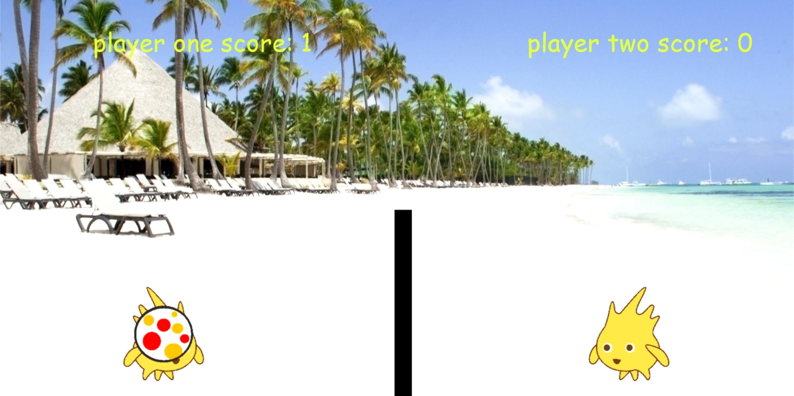
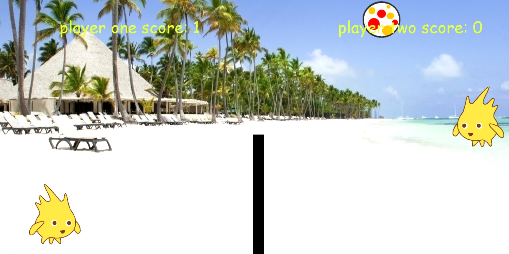
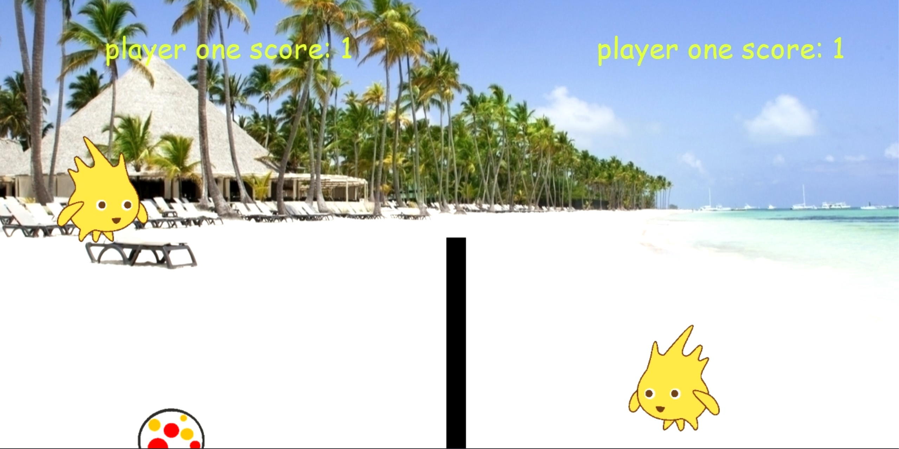

<link rel="stylesheet" type="text/css" media="all" href="style.css" />

# Creative Computing with Python

<video width="960" height="540" controls>
  <source src="JennyFinalEdit.mp4" type="video/mp4">
  Your browser does not support the video tag.
</video>

## Overview

這個項目是模仿一款遊戲叫做【皮卡丘排球】。想要設計這款遊戲是因為在國中時，同學們下課都會圍在電腦桌前玩這個遊戲，加上我自己也很喜歡玩，也很喜歡排球。想說自己設計看看，可以把自己的想發與\創意融入到遊戲中。

## Specifications

這遊戲是用pythan做的。遊戲中包含了許多技巧，像是需要用到物理學，要設定角色的移動方向、球落地時因為受到地心引力而速度要放慢、球打到網子或者是視窗邊邊要反彈。最一開始要先選好腳色，再來就是把遊戲套用到排球的規則，有設定得分還有換邊發球，光一個發球就包含了好多技巧，首先球會在角色一那方，當腳色二得到發球權時，必須等到兩個角色都落第時才能發球；按W(角色一)跟上鍵(角色二)是發球，發球時角色按上不會跳，除了發球時角色一按W(向上跳)、 A(向左)、 D(向右)，角色二按上(向上跳)、 左(向左)、 右(向右)。

### States

1. Wait For Serve

2. Play

3. Wait For Jump

## Reflection 
這個項目讓我學到了很多，因為我也才剛接觸程式設計不到一個學期，要自己設計一個遊戲是有一點小困難，尤其我想設計的這款也是有一點小難度的，不過，花了四堂課，共11個斈時的時間終於完成了，而且也有達到我理想中的樣子。

